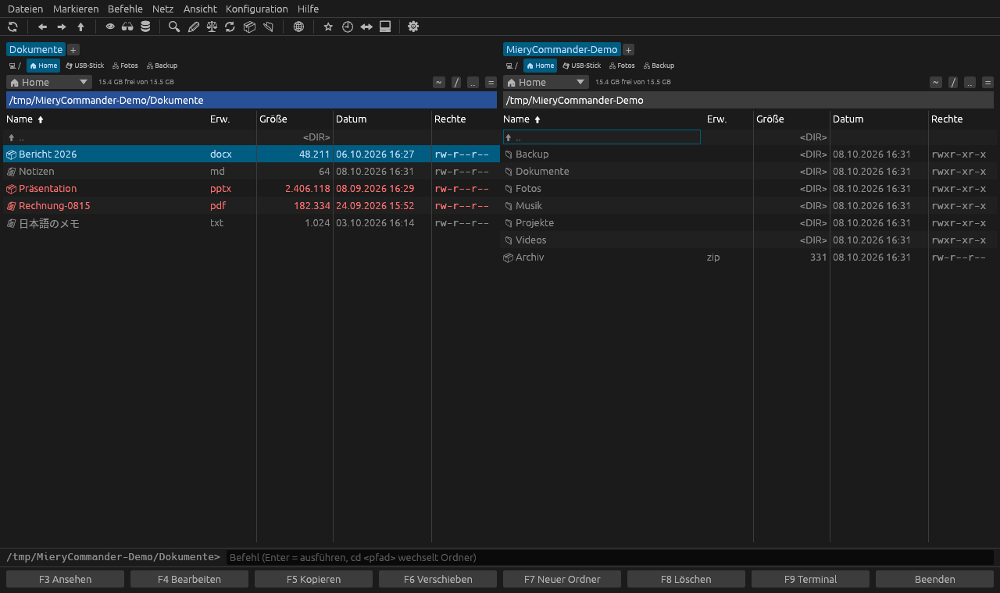

# MieryCommander

Zweispaltiger Dateimanager – geschrieben in Rust mit
[egui](https://github.com/emilk/egui), läuft auf **Linux**, **macOS** und **Windows**.

**Webseite:** <https://evil8810.github.io/MieryCommander/>



## Download

Fertige Pakete gibt es unter [Releases](https://github.com/Evil8810/MieryCommander/releases/latest):

- **Linux:** `MieryCommander-…-x86_64.AppImage` – ausführbar machen (`chmod +x`) und starten; mit Gear Lever
  ins Startmenü. Oder das `.tar.gz` entpacken und `./install-desktop.sh` ausführen (installiert nach `~/.local`).
- **macOS:** `MieryCommander-…-macos-universal.dmg` (Intel & Apple Silicon) – beim ersten Start Rechtsklick → Öffnen.
- **Windows:** `MieryCommander-…-windows-x86_64.zip` – entpacken und `miery_commander.exe` starten. Warnt Windows beim ersten Start („Der Computer wurde durch Windows geschützt“): Weitere Informationen → Trotzdem ausführen (das Programm ist nicht bei Microsoft signiert).

Linux-Pakete selbst bauen: `./package-linux.sh` (landet in `target/linux`).

## Bauen & Starten

Voraussetzung: Rust (z. B. `brew install rust` oder <https://rustup.rs>).

```bash
cargo run --release              # starten
cargo run --release -- ~/Bilder  # mit Startordner im linken Panel
cargo test                       # Tests (laufen headless)
```

Die Server-Tests brauchen lokale Testserver (Benutzer `test`/`geheim`): FTP auf Port 2121,
FTPS explizit mit selbstsigniertem Zertifikat auf 2122, SFTP auf 2222 (Schlüssel siehe
`sftp_workflow` in `src/tests.rs`). Ohne die Variablen werden sie übersprungen:

```bash
MIERY_FTP_TEST=127.0.0.1 MIERY_FTP_ROOT=/srv/ftp MIERY_SFTP_TEST=127.0.0.1 MIERY_SFTP_ROOT=/srv/sftp MIERY_SFTP_KEYS=/srv/keys cargo test
```

Das fertige Programm liegt danach in `target/release/miery_commander`.

**Ins Startmenü (Linux, mit Disketten-Icon):** einmal ausführen – richtet Menüeintrag und Icon
in `~/.local/share` ein (kein `sudo` nötig):

```bash
./install-desktop.sh
```

**macOS:** Als App mit Icon bauen und in „Programme“ installieren (installiert bei Bedarf Rust über
Homebrew; mit `--dmg` entsteht zusätzlich eine .dmg-Datei, mit `--universal` eine App für Intel und
Apple Silicon):

```bash
./install-macos.sh
```

Ohne App-Paket gehen auch hier die normalen Befehle. Auf Mac-Tastaturen F-Tasten mit `fn` drücken oder die
Leiste unten benutzen; `Strg`-Kürzel sind dort `Cmd`-Kürzel. `Cmd+Backspace` löscht.

## Funktionen

- Zwei Panels mit **Tabs**, Pfadleiste (Doppelklick = Pfad eingeben), freier Speicher
- **Laufwerksleiste:** ein Knopf pro Laufwerk/Freigabe über jedem Panel (der aktuelle ist hervorgehoben), wahlweise nur Knöpfe, nur Dropdown oder beides (Ansicht → Laufwerksleiste oder Einstellungen)
- **Laufwerksauswahl** mit Home, USB-Medien und **Netzlaufwerken**: eingehängte SMB/CIFS-, NFS-, SSHFS-, rclone- und WebDAV-Freigaben werden automatisch erkannt, egal wo sie eingehängt sind (Linux), außerdem GNOME-Freigaben (gvfs), unter macOS alles in `/Volumes` und unter Windows alle Laufwerksbuchstaben (auch USB- und Netzlaufwerke)
- Spalten Name / Erw. / Größe / Datum / Rechte, Sortierung per Klick oder `Strg+F3…F6`, natürliche Sortierung (`file2` < `file10`)
- Markieren wie in TC: `Einfg`, `Leertaste` (berechnet Ordnergröße), `Shift+Pfeile`, `+` / `-` / `*` mit Masken (`*.jpg;*.png`), Strg/Shift-Klick
- **Zwischenablage:** `Strg+C` / `Strg+X` / `Strg+V` für Dateien und Ordner – auch zwischen lokal, Servern und ZIP-Archiven; unter Wayland mit Dolphin, Nautilus & Co. geteilt. Kopie in denselben Ordner wird zu „Name (2)“, Ausgeschnittenes erscheint ausgegraut
- **Kontextmenü** (Rechtsklick) mit allen Dateiaktionen; Rechtsklick auf freie Fläche: Einfügen, Neuer Ordner, Neue Datei …
- **Öffnen mit** (Rechtsklick oder `Shift+Enter`): die passenden Programme wie im System-Dateimanager, Standardprogramm mit ★; „Andere Anwendung…“ listet alle Programme oder nimmt einen eigenen Befehl
- **Ziehen mit der Maus:** Dateien ins andere Panel oder auf einen Ordner ziehen = Kopieren, mit `Shift` = Verschieben. Dateien aus anderen Programmen ins Fenster ziehen geht ebenfalls
- **Schriftgröße:** `Strg++` / `Strg+-` / `Strg+0`, `Strg+Mausrad` oder **A− / A+** in der Werkzeugleiste; auf großen Monitoren ohne System-Skalierung (z. B. 4K bei 100 %) wird automatisch vergrößert. Ordner stehen in **Fettschrift**
- **Updates:** sucht beim Start (abschaltbar) nach einer neuen Version und installiert sie auf Wunsch direkt – AppImage, tar.gz-Installation, macOS-App und Windows-.exe; Hilfe → Nach Updates suchen
- **Dateinamen in jeder Schrift** (Japanisch, Chinesisch, Koreanisch, Arabisch, Hebräisch, Thai, …) über die Schriften des Systems
- **F3** Lister (Text, Hex, Bilder) · **F4** Editor (konfigurierbar) · **F5/F6** Kopieren/Verschieben im Hintergrund mit Fortschritt, Abbrechen und **Überschreiben-Dialog** (Alle / Ältere / Überspringen / Umbenennen) · **F7** Ordner (auch `a/b/c`) · **F8** Papierkorb, `Shift+F8` endgültig
- **Archive wie Ordner:** ZIP (auch .jar/.docx/.odt …), **7z**, **RAR** (nur lesen), **TAR** mit .gz/.bz2/.xz/.zst sowie einzelne .gz/.bz2/.xz/.zst-Dateien – öffnen, Dateien herauskopieren (F5, Strg+C/V), ansehen (F3), entpacken (**Smart hier entpacken** `Alt+Shift+F9` – eigener Ordner nur, wenn das Archiv mehrere Dateien direkt enthält; **Hier entpacken**; **Entpacken nach…** `Alt+F9`, auch mehrere Archive auf einmal), packen (`Alt+F5`, Format über die Endung: .zip, .7z, .tar, .tar.gz, .tar.xz, .tar.bz2, .tar.zst). Pfade wie `../` in Archiven werden abgewiesen
- **Branch-View** (`Strg+Shift+B`): alle Dateien aller Unterordner in einer Liste
- **Dateien vergleichen** (Menü Dateien / Kontextmenü): nebeneinander mit farbigen Unterschieden, Hervorhebung innerhalb der Zeile, Springen mit N/P, Binärdateien byteweise
- **Verzeichnisse synchronisieren** (Menü Befehle / 🔃): Vergleich nach Datum oder Inhalt, inkl. Unterordner und leerer Ordner, Aktion pro Datei änderbar (➡ ⬅ 🗑), asymmetrischer Spiegel-Modus, Dateimaske
- **Suche** (`Alt+F7`): Wildcards oder RegEx, Textinhalt, Ergebnis „Gehe zu Datei“
- **Mehrfach-Umbenennen** (`Strg+M`): `[N]`, `[N2-5]`, `[E]`, `[C]` Zähler, `[P]`, `[Y][M][D]`, Suchen/Ersetzen (auch RegEx), Groß/klein, Live-Vorschau
- **Schnellansicht** (`Strg+Q`), **Schnellfilter** (`Strg+S`), Schnellsuche durch Lostippen
- Verlauf (`Alt+←/→/↓`), **Favoriten** (`Strg+D`), Ordner vergleichen, Panels tauschen (`Strg+U`), **gleicher Ordner wie im anderen Panel** (`Strg+G` oder Knopf „=“)
- **SMB-Freigaben (Windows/NAS)** über den Verbindungsdialog: Server + optional Freigabe (leer = alle Freigaben auflisten). **🔍 Suchen** findet SMB-Server im Netzwerk (Bonjour/Avahi), **📂 Anzeigen** listet die Freigaben eines Servers; ohne Benutzer wird als Gast verbunden. Eingebunden wird wie im System-Dateimanager – KDE über kio-fuse (Anmeldung über KDE/KWallet wie in Dolphin), GNOME über `gio mount`, macOS über den Finder, Windows direkt als `\\\\server\\freigabe` (Anmeldung über Windows). Kein `sudo` nötig; eingebundene Freigaben erscheinen in der Laufwerksauswahl
- **SFTP-, FTP- und FTPS-Client** (`Strg+F` verbinden, `Strg+Shift+F` trennen, Menü **Netz**):
  - Server wie einen Ordner im Panel durchsuchen; F5/F6 zwischen lokal und Server (rekursiv, mit Fortschritt und Überschreiben-Dialog), F7, F8, Shift+F6 direkt auf dem Server
  - F3/Enter auf Serverdateien lädt sie in einen Cache und öffnet sie; nach Bearbeiten mit **F4** bietet die App an, die Datei wieder hochzuladen
  - **SFTP** (SSH): Anmeldung per Passwort, Schlüsseldatei (auch mit Passphrase), SSH-Agent oder `~/.ssh/id_*`; Host-Schlüssel werden gegen `~/.ssh/known_hosts` geprüft, unbekannte Server erst nach Bestätigung des Fingerabdrucks, geänderte Schlüssel werden blockiert
  - FTPS explizit (AUTH TLS) und implizit, Passiv-/Aktivmodus, optional selbstsignierte Zertifikate
  - Gespeicherte Verbindungen; Passwörter liegen im **System-Schlüsselbund** (KWallet/GNOME-Schlüsselbund, macOS-Schlüsselbund, Windows-Anmeldeinformationsverwaltung), nie in der Konfigurationsdatei
  - Verbindungsabbrüche werden automatisch neu aufgebaut, Dateien per Drag & Drop hochladen
- Kommandozeile unten (`cd` wechselt Ordner, `Strg+Enter` übernimmt Dateinamen), Terminal hier öffnen (F9)
- Dateien aus anderen Programmen per Drag & Drop hineinziehen
- **Bleibt immer bedienbar:** Ordner, Archive, Vorschau, Ordnergrößen und Server-Aktionen laufen im Hintergrund. Ein Spinner in der Pfadleiste und unten rechts zeigt, was gerade arbeitet; hängt ein Netzlaufwerk länger als 3 s, bietet das Panel „Abbrechen“ an
- **Deutsch und Englisch:** Sprache folgt dem System oder wird in den Einstellungen gewählt (sofort wirksam), inkl. Zahlen- und Datumsformat
- Automatisches Neueinlesen bei Änderungen, Hell/Dunkel/System-Design, Schriftgröße
- Tabs, Favoriten und Einstellungen bleiben nach Neustart erhalten

Alle Kürzel: Menü **Hilfe → Tastenkürzel**.

## Aufbau

| Datei | Inhalt |
|---|---|
| `src/app.rs` | App-Zustand, Befehle, Tastenbelegung, Menü/Toolbar/F-Tasten |
| `src/panel.rs` | Panel, Tabs, Dateiliste, Sortierung, Markierung |
| `src/ops.rs` | Kopieren/Verschieben/Löschen/Packen/Entpacken im Hintergrund-Thread |
| `src/dialogs.rs` | Dialoge (Kopieren, Löschen, Favoriten, Einstellungen, …) |
| `src/viewer.rs` | Lister (F3) und Schnellansicht |
| `src/search.rs` | Dateisuche |
| `src/rename.rs` | Mehrfach-Umbenennen |
| `src/archive.rs` | ZIP-Archive durchsuchen |
| `src/remote.rs` | Gemeinsame Schnittstelle für Server-Verbindungen, gespeicherte Server, Schlüsselbund |
| `src/ftp.rs` | FTP/FTPS (suppaftp + rustls) |
| `src/sftp.rs` | SFTP (russh, reines Rust), Host-Key-Prüfung, SSH-Agent/Schlüssel |
| `src/fsutil.rs` | Dateisystem-Helfer, Formatierung, Mounts, externe Programme |
| `src/tests.rs` | Headless-UI-Tests mit egui_kittest |

## Noch nicht umgesetzt

Thumbnail-Ansicht, Video-Vorschau, Protokoll der Dateioperationen, eigene Spalten,
separate Baumansicht, HTTP-Proxy für FTP, Plugins.

## Lizenz

MieryCommander steht unter der [MIT-Lizenz](LICENSE).

Für das Lesen von RAR-Archiven ist über die Rust-Crate [`unrar`](https://crates.io/crates/unrar)
der UnRAR-Quellcode von Alexander Roshal enthalten. Er steht unter der UnRAR-Lizenz: Er darf frei
verwendet werden, aber nicht, um einen RAR-kompatiblen Packer zu bauen – MieryCommander kann RAR
daher nur entpacken, nicht erstellen.
